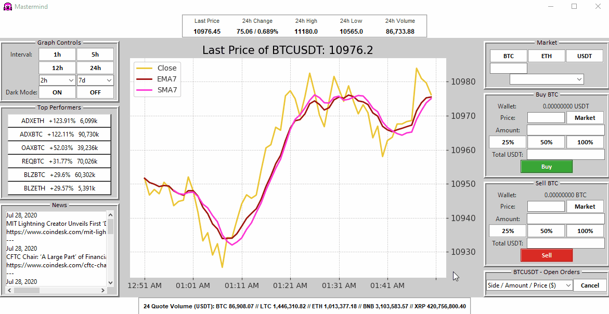

# Mastermind 
**Mastermind** is a gui for buying, selling and analyzing cryptocurreny. It was created to allow users to trade, without ever logging onto the site. Just enter your API keys once and forget about opening up a browser!

- Simple and straightforward
- Supports **BTC**, **ETH** and **USDT** markets

  

## How it works

1. Login into [Binance](https://www.binance.com/en)
2. Create an API key
   - Settings --> [API Management](https://www.binance.com/en/usercenter/settings/api-management) --> Enter label name for API key --> click ***Create***
   - Make sure you enable "**Enable Trading**" and "**Read Only**"
   - **DO NOT** enable ***Enable Withdrawals***, Mastermind does not support sending and receiving crypto and could put your wallet at risk if enabled
3. Enter API key and API secrect into Login Page (see below)
4. Enjoy an all in one platform for all things trading crypto!

  

## What I Learned
- Tkinter
- SQLite 
- Object Oriented Programming
- Binance API's
- Matplotlib
- Pandas

## Credits
### Built using [Sam McHardy's](https://github.com/sammchardy) python-binance

*Source code:*
   https://github.com/sammchardy/python-binance
   
*Documentation:*
   https://python-binance.readthedocs.io/en/latest/

## Plugins and Presets
- Built on Python **3.7.7**
- Graph initially set to show 1-hour of data
- Initial coin is 'BTCUSDT'

